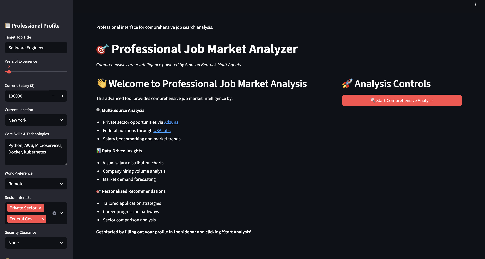

# Professional Job Market Analyzer

[](https://aws.amazon.com/)
[](https://python.org)
[](https://aws.amazon.com/bedrock/)
[](https://aws.amazon.com/cdk/)
[](https://modelcontextprotocol.io/)
[](https://strandsagents.com/)

> This project presents the **Professional Job Market Analyzer**, an advanced generative AI solution built using Amazon Bedrock with Model Context Protocol (MCP) integration and Strands Agents. It concists of a Career Strategy Coordinator which orchestrates specialized job search agents to provide comprehensive career intelligence through intelligent agent coordination.

## 📋 Table of Contents

- [Features](#features)
- [Project Structure](#project-structure)
- [Architecture](#architecture)
- [Getting Started](#getting-started)
- [Prerequisites](#prerequisites)
- [Configuration](#configuration)
- [Deployment](#deployment)

## Features

- **Multi-Agent Orchestration** - Coordinated job search across multiple platforms
- **MCP Integration** - Model Context Protocol for enhanced agent communication
- **Dual-Source Intelligence** - Private sector (Adzuna) and federal jobs (USAJobs)
- **Real-time Processing** - Serverless ECS Fargate for scalable responses
- **Interactive Interface** - Professional Streamlit web application
- **Salary Analytics** - Visual salary distribution charts and market analysis
- **Auto-scaling Infrastructure** - Dynamic scaling based on demand

## Project Structure

```
├── Architecture/                # Architecture diagrams
│   └── Architecture.png         # System architecture diagram
├── screenshots/                 # Application screenshots
├── secrets/                     # API credentials (not in version control)
│   ├── adzuna.json              # Adzuna API credentials
│   └── usajobs.json             # USAJobs API credentials
├── streamlit/                   # Frontend application
│   ├── charts/                  # Generated salary charts
│   ├── mcp_servers/             # MCP server implementations
│   │   ├── adzuna/              # Adzuna job search MCP server
│   │   │   └── index.py         # Adzuna API integration
│   │   └── usajobs/             # USAJobs MCP server
│   │       └── index.py         # USAJobs API integration
│   ├── chatbot_st.py            # Main Streamlit interface
│   ├── multi_agent_mcp_jobs.py  # Job orchestrator agent
│   ├── Dockerfile               # Container configuration
│   └── requirements.txt         # Application dependencies
├── app.py                       # CDK application entry point
├── bedrock_mcp_stack.py         # CDK stack definition
├── cdk.json                     # CDK configuration
├── README.md                    # This documentation
└── requirements.txt             # CDK dependencies
```

## Architecture

> **📥 Download**: [Architecture Diagram](Architecture/Architecture.zip) (if image not displayed)


The system uses a containerized multi-agent architecture with MCP integration:

- **Job Orchestrator Agent** - Coordinates job search across multiple sources
- **Adzuna MCP Server** - Handles private sector job searches and salary data
- **USAJobs MCP Server** - Processes federal government job opportunities
- **ECS Fargate** - Serverless container hosting with auto-scaling
- **Application Load Balancer** - High availability and traffic distribution
- **CloudFront** - Global content delivery and caching

## Getting Started

### Prerequisites

- **AWS Account** with appropriate permissions
  - IAM permissions for Bedrock, ECS, VPC, CloudFront, Secrets Manager
  - Account ID required for CDK deployment
- **AWS CDK v2** installed and configured
- **Amazon Bedrock** access enabled in us-east-1 region
  - Claude 3.7 Sonnet model access required
- **Node.js 18+** for CDK
- **Docker** for containerized deployment
- **AWS CLI** configured with credentials

### Configuration

1. **API Account Creation**
   
   Create developer accounts for the required APIs:
   
   - **Adzuna API**: Register at https://developer.adzuna.com/
   - **USAJobs API**: Register at https://developer.usajobs.gov/

2. **API Credentials Setup**
   
   Create credential files in the `secrets/` directory:
   
   ```bash
   # secrets/adzuna.json
   {
     "ADZUNA_APP_ID": "your_adzuna_app_id",
     "ADZUNA_APP_KEY": "your_adzuna_app_key"
   }
   
   # secrets/usajobs.json
   {
     "USAJOBS_EMAIL": "your_email@example.com",
     "USAJOBS_API_KEY": "your_usajobs_api_key"
   }
   ```

3. **Environment Setup**
   ```bash
   # Create and activate virtual environment
   python -m venv venv
   source venv/bin/activate 
   
   # Install Python dependencies
   pip install -r requirements.txt
   ```

4. **Configure AWS Account**
   ```bash
   # Set your AWS account ID and region
   export CDK_DEFAULT_ACCOUNT=123456789012  # Replace with your account ID
   export CDK_DEFAULT_REGION=us-east-1      # We are using the us-east-1 region
   
   # Bootstrap CDK (first time only)
   cdk bootstrap aws://$CDK_DEFAULT_ACCOUNT/$CDK_DEFAULT_REGION
   ```

## Deployment

### Detailed Deployment Steps

1. **Synthesize CloudFormation Template**
   ```bash
   cdk synth
   ```

2. **Deploy Infrastructure**
   ```bash
   cdk deploy --context account=$CDK_DEFAULT_ACCOUNT --context region=$CDK_DEFAULT_REGION
   ```

3. **Access Application**
   - Application will be available via CloudFront URL (output from CDK)
   - Use the provided URL to access the job search interface

### Infrastructure Components

The CDK stack deploys:

- **VPC with Private Subnets** - Secure networking with VPC endpoints
- **ECS Fargate Cluster** - Serverless container hosting
- **Application Load Balancer** - Traffic distribution and health checks
- **CloudFront Distribution** - Global CDN for optimal performance
- **Secrets Manager** - Secure API credential storage
- **Auto Scaling** - Dynamic scaling (2-10 instances based on CPU)
- **CloudWatch Logs** - Centralized logging and monitoring

### VPC Endpoints

The stack includes VPC endpoints for secure AWS service access:
- Bedrock Runtime
- Bedrock Agent Runtime
- ECR API and DKR
- Secrets Manager
- CloudWatch Logs

## Contents Overview

### MCP Servers
Model Context Protocol implementations for job search services:
- **Adzuna MCP Server**: Private sector job search, salary statistics, company data
- **USAJobs MCP Server**: Federal government job opportunities and requirements

### Streamlit Application
Professional job market analyzer with features:
- **Multi-Source Analysis**: Combined private and federal job search
- **Salary Visualization**: Interactive charts and market trends
- **Personalized Recommendations**: Tailored based on user profile
- **Real-time Processing**: Live job market data and analysis

### Usage patterns
- **Job Search Queries**: Various search patterns and filters
- **Salary Analysis**: Market research and compensation benchmarking
- **Company Research**: Employer analysis and hiring trends
- **Career Planning**: Professional development pathways

### Screenshots
Application interface examples:
- **Home Page**: Main job search interface
- **Analysis Results**: Job search results and salary analytics

> **📥 Download**: [Screenshot](screenshots/screenshots.zip) (if image not displayed)




