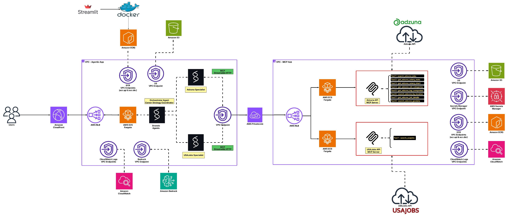
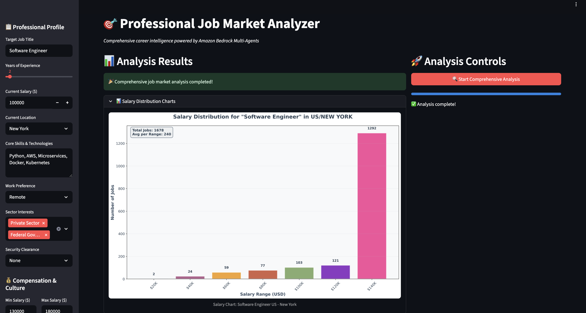

# HR Bedrock MCP Stack

[](https://aws.amazon.com/cdk/)
[](https://python.org)
[](https://aws.amazon.com/bedrock/)
[](https://aws.amazon.com/ecs/)
[](https://modelcontextprotocol.io/)
[](https://strandsagents.com/)

> This project presents the second version of the **Professional Job Market Analyzer**, a cloud-native infrastructure solution built using AWS CDK for deploying multi-agent job search applications with Model Context Protocol (MCP) integration. It orchestrates containerized MCP servers and Streamlit applications across secure VPC environments with auto-scaling capabilities.

## 📋 Table of Contents

- [Features](#features)
- [Project Structure](#project-structure)
- [Architecture](#architecture)
- [Getting Started](#getting-started)
- [Prerequisites](#prerequisites)
- [Configuration](#configuration)
- [Deployment](#deployment)

## Features

- **Multi-VPC Architecture** - Isolated networks for tools and agents with PrivateLink connectivity
- **Containerized MCP Servers** - Scalable Adzuna and USAJobs API integrations
- **Auto-scaling ECS Fargate** - Serverless container orchestration with dynamic scaling
- **CloudFront Distribution** - Global CDN for optimal application performance
- **Secrets Management** - Secure API credential storage with AWS Secrets Manager
- **VPC Endpoints** - Private connectivity to AWS services without internet routing
- **S3 Chart Storage** - Salary visualization chart storage

## Project Structure

```
├── Architecture/                # Architecture diagrams
│   ├── Architecture.jpeg        # System architecture diagram
├── screenshots/                 # Application screenshots
├── mcp_servers/                 # MCP server implementations
│   ├── adzuna/                  # Adzuna job search MCP server
│   │   ├── Dockerfile           # Container configuration
│   │   ├── index.py             # FastMCP server implementation
│   │   └── requirements.txt     # Python dependencies
│   └── usajobs/                 # USAJobs MCP server
│       ├── Dockerfile           # Container configuration
│       ├── index.py             # FastMCP server implementation
│       └── requirements.txt     # Python dependencies
├── secrets/                     # API credentials (gitignored)
│   ├── adzuna.json              # Adzuna API credentials
│   └── usajobs.json             # USAJobs API credentials
├── streamlit/                   # Frontend application
│   ├── chatbot_st.py            # Main Streamlit interface
│   ├── multi_agent_jobs.py      # Multi-agent orchestrator
│   ├── Dockerfile               # Container configuration
│   └── requirements.txt         # Application dependencies
├── app.py                       # CDK application entry point
├── hr_bedrock_mcp_stack.py      # Main CDK stack definition
├── cdk.json                     # CDK configuration
├── README.md                    # This documentation
└── requirements.txt             # CDK dependencies
```

## Architecture

> **📥 Download**: [Architecture Diagram](Architecture/Architecture.zip)



The system implements a secure multi-VPC architecture with the following components:

### MCP Server Hub VPC 
- **ECS Fargate Cluster** - Containerized Adzuna and USAJobs MCP servers
- **Internal Network Load Balancer** - Private load balancing for MCP services (ports 8001, 8002)
- **VPC Endpoint Service** - Exposes MCP servers via PrivateLink
- **VPC Endpoints** - Bedrock, ECR, Secrets Manager, CloudWatch Logs, S3

### Agentic App VPC 
- **ECS Fargate Cluster** - Streamlit application container
- **Internet-facing Network Load Balancer** - Public access on port 80
- **Interface VPC Endpoint** - Secure PrivateLink connection to MCP servers
- **VPC Endpoints** - Complete AWS service connectivity

### Cross-VPC Connectivity
- **VPC Endpoint Service** - Exposes MCP servers via PrivateLink
- **Interface VPC Endpoint** - Consumes MCP tools in agentoc App VPC

### AWS Services Integration
- **Amazon Bedrock** - Claude 3.7 Sonnet for AI model
- **ECS Fargate** - Serverless container hosting
- **CloudFront** - Global content delivery network
- **S3** - Chart storage
- **Secrets Manager** - Secure credential management

## Getting Started

### Prerequisites

- **AWS Account** with appropriate permissions
  - IAM permissions for Bedrock, ECS, VPC, CloudFront, Secrets Manager
  - Account ID required for CDK deployment
- **AWS CDK v2** installed and configured
- **Amazon Bedrock** access enabled in us-east-1 region
  - Claude 3.7 Sonnet model access required
- **Node.js 18+** for CDK
- **Docker** for containerized deployment
- **AWS CLI** configured with credentials

### Configuration

1. **API Account Creation**
   
   Create developer accounts for the required APIs:
   
   - **Adzuna API**: Register at https://developer.adzuna.com/
   - **USAJobs API**: Register at https://developer.usajobs.gov/

2. **API Credentials Setup**
   
   Create credential files in the `secrets/` directory:
   
   ```bash
   # secrets/adzuna.json
   {
     "ADZUNA_APP_ID": "your_adzuna_app_id",
     "ADZUNA_APP_KEY": "your_adzuna_app_key"
   }
   
   # secrets/usajobs.json
   {
     "USAJOBS_EMAIL": "your_email@example.com",
     "USAJOBS_API_KEY": "your_usajobs_api_key"
   }
   ```

3. **Environment Setup**
   ```bash
   # Create and activate virtual environment
   python -m venv venv
   source venv/bin/activate  
   
   # Install Python dependencies
   pip install -r requirements.txt
   ```

4. **Configure AWS Account**
   ```bash
   # Set your AWS account ID and region
   export CDK_DEFAULT_ACCOUNT=123456789012  # Replace with your account ID
   export CDK_DEFAULT_REGION=us-east-1      # We are using the us-east-1 region
   
   # Bootstrap CDK (first time only)
   cdk bootstrap aws://$CDK_DEFAULT_ACCOUNT/$CDK_DEFAULT_REGION
   ```

## Deployment

### Detailed Deployment Steps

1. **Synthesize CloudFormation Template**
   ```bash
   cdk synth
   ```

2. **Deploy Infrastructure**
   ```bash
   cdk deploy --context account=$CDK_DEFAULT_ACCOUNT --context region=$CDK_DEFAULT_REGION
   ```

3. **Access Application**
   - Application will be available via CloudFront URL (output from CDK)
   - Use the provided URL to access the job search interface

### Infrastructure Components

The CDK stack deploys:

- **VPC MCP Hub** - Private network (10.1.0.0/16) for MCP servers
- **VPC Agentic App** - Private network (10.2.0.0/16) for applications
- **VPC Endpoints** - Bedrock, ECR, Secrets Manager, CloudWatch Logs, S3
- **ECS Fargate Clusters** - Serverless container hosting in both VPCs
- **Auto Scaling** - Dynamic scaling (1-5 instances based on CPU utilization)
- **Network Load Balancers** - Internal (MCP Hub) and external (Agentic App) load balancing
- **CloudFront Distribution** - Global CDN with caching optimization
- **S3 Bucket** - Chart storage management

### VPC Endpoints

The stack includes VPC endpoints for secure AWS service access:
- Bedrock Runtime
- Bedrock Agent Runtime
- ECR API and DKR
- Secrets Manager
- CloudWatch Logs
- S3

### MCP Servers
Model Context Protocol implementations for job search services:
- **Adzuna MCP Server**: Private sector job search, salary statistics, company data
- **USAJobs MCP Server**: Federal government job opportunities and requirements

### Streamlit Application
Professional job market analyzer with features:
- **Multi-Agent Orchestration** - Coordinated private and federal job search
- **Interactive Interface** - Professional profile configuration
- **Real-time Analysis** - Live job market data processing
- **Salary Visualization** - Automated chart generation and display
- **Personalized Recommendations** - Tailored career intelligence

### Usage patterns
- **Job Search Queries**: Various search patterns and filters
- **Salary Analysis**: Market research and compensation benchmarking
- **Company Research**: Employer analysis and hiring trends
- **Career Planning**: Professional development pathways

### Screenshots
Application interface examples:
- **Home Page**: Main job search interface
- **Analysis Results**: Job search results and salary analytics

> **📥 Download**: [Screenshot](screenshots/screenshots.zip) (if image not displayed)





