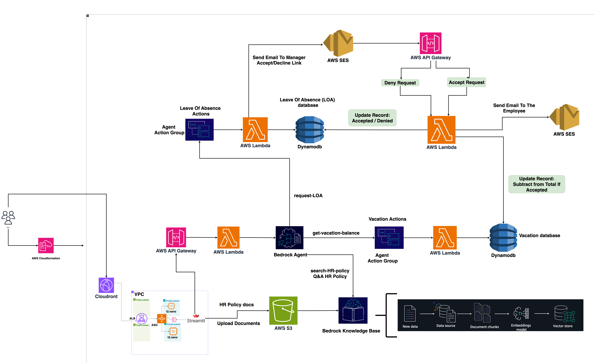

# GenAI HR Assistant Agent

[](https://aws.amazon.com/)
[](https://python.org)
[](https://aws.amazon.com/bedrock/)
[](https://aws.amazon.com/cloudformation/)

> This project presents the **HR Assistant Agent**, a generative AI-powered solution built using AWS Bedrock and other AWS services. It is designed to automate routine HR inquiries, enhance employee support, and streamline information access through natural language interactions.


## 📋 Table of Contents

- [Features](#features)
- [Video Demonstration](#video-demonstration)
- [Project Structure](#project-structure)
- [Contents](#contents)
- [Architecture](#architecture)
- [Getting Started](#getting-started)
- [Quick Start](#quick-start)
- [Prerequisites](#prerequisites)
- [Configuration](#configuration)
- [Sample Data](#sample-data)


## Features

- **Natural Language Processing** - Understands complex HR queries in plain English
- **Company Policy Integration** - Searches through uploaded HR policy documents
- **Real-time AI Responses** - Powered by Amazon Bedrock Agents
- **HR Request Management** - Automated HR request management such as leave request processing and approvals
- **Email Notifications** - Automatic notifications via Amazon SES
- **Multi-model AI Support** - Configurable embedding and text generation models using Amazon Bedrock

### Video Demonstration

A video demonstration of the agent in action is available in the `Video/` folder:


[](Video/demo-hr-assistant-agent.mp4)

**📁 Local Video**: `Video/demo-hr-assistant-agent.mp4`

## Project Structure

```
├── Architecture/           
│   └── Architecture.png   
├── cfn/                   
│   └── CFN-AWS-GenAI-HR-Assistant-Agent.yaml
├── data/                  
│   ├── Companyxyz Employee Handbook.pdf
│   └── employee-data-items.json
├── Video/
│   └── demo-hr-assistant-agent.mp4
├── streamlit-auth.txt
└── README.md             
```

## Contents

- **Architecture/**: Contains the solution's architectural diagram.
- **Video/**: Contains the recorded demo video.
- **cfn/**: AWS CloudFormation template to deploy the infrastructure.
- **data/**: Includes the employee data and the sample HR handbook used by the assistant.
- **streamlit-auth.txt**: Authentication file for the Streamlit frontend (login and password).

## Architecture

> **📥 Download**: [Architecture Diagram](Architecture/Architecture.zip) (if image not displayed)




## Getting Started

To deploy the solution:

1. Deploy the CloudFormation template from the `cfn/` directory.
2. Upload the employee HR handbook and data to the appropriate S3 bucket and Employee Info DynamoDB table respectively.
3. Launch the Streamlit app and authenticate using the provided credentials.
4. Start interacting with the HR Assistant!

## Quick Start

```bash
# Deploy infrastructure
aws cloudformation deploy \
  --template-file cfn/CFN-AWS-GenAI-HR-Assistant-Agent.yaml \
  --stack-name hr-assistant \
  --capabilities CAPABILITY_IAM \
  --parameter-overrides \
    SourceEmailAddress=your-email@company.com \ 
    EmbeddingModelName=amazon.titan-embed-text-v1 \
    TextModelName=anthropic.claude-3-sonnet-20240229-v1:0
```

## Prerequisites

- **AWS Account** with appropriate permissions
- **AWS CLI** configured with credentials
- **Amazon Bedrock** access enabled in your region
- **Valid email address** for SES (verified in SES console: **You can use your verified gmail address for both source and destination addresses for quick test**)


## Configuration

Key parameters in the CloudFormation template:
- **EmbeddingModelName** - Model for document embeddings
- **TextModelName** - Model for response generation
- **SourceEmailAddress** - Email for SES notifications

## Sample Data

The `data/` folder contains:
- **Employee Handbook** - Sample company Employee HR handbook
- **Employee Data Items** - Sample JSON structure for employee information
