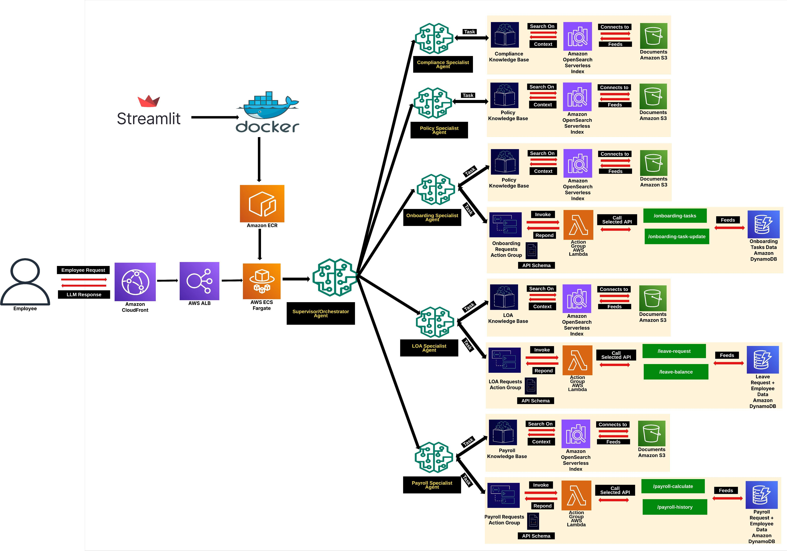

# HR Assistant Multi-Agent System

[](https://aws.amazon.com/)
[](https://python.org)
[](https://aws.amazon.com/bedrock/)
[](https://aws.amazon.com/cdk/)

> This project presents the **HR Assistant Multi-Agents System**, an advanced generative AI solution built using Amazon Bedrock's multi-agents collaboration framework. It orchestrates specialized HR agents to handle complex workflows through intelligent agent coordination.

## 📋 Table of Contents

- [Features](#features)
- [Project Structure](#project-structure)
- [Architecture](#architecture)
- [Getting Started](#getting-started)
- [Quick Start](#quick-start)
- [Prerequisites](#prerequisites)
- [Configuration](#configuration)
- [Sample Data](#sample-data)

## Features

- **Multi-Agent Orchestration** - Supervisor agent coordinates specialized HR agents
- **Intelligent Routing** - Context-aware request routing to appropriate specialists
- **Specialized Agents** - Payroll, Onboarding, Leave, Compliance, and Policy specialists
- **Knowledge Base Integration** - Vector-based search across HR documents
- **Real-time Processing** - Serverless Lambda functions for instant responses
- **Streamlit Interface** - Interactive web application with agent tracing

## Project Structure

```
├── api-schemas/           # API specifications for agents
│   ├── loa_agent.yaml     # Leave of Absence agent API
│   ├── onboarding_agent.yaml # Onboarding agent API
│   └── payroll_agent.yaml # Payroll agent API
├── Architecture/          # Architecture diagrams
│   └── Architecture.jpeg  # System architecture diagram
├── instructions/          # Agent instruction files
│   ├── orchestrator_agent.txt # Main orchestrator instructions
│   ├── payroll_agent.txt  # Payroll specialist instructions
│   ├── onboarding_agent.txt # Onboarding specialist instructions
│   ├── loa_agent.txt      # Leave specialist instructions
│   ├── compliance_agent.txt # Compliance specialist instructions
│   └── policy_agent.txt   # Policy specialist instructions
├── knowledge_base_files/  # Knowledge base content
│   ├── payroll-kb/        # Payroll knowledge documents
│   ├── onboarding-kb/     # Onboarding knowledge documents
│   ├── loa-kb/           # Leave of absence knowledge
│   ├── compliance-kb/     # Compliance knowledge documents
│   └── policy-kb/        # Policy knowledge documents
├── lambda_functions/      # AWS Lambda functions
│   ├── payroll_agent/     # Payroll processing functions
│   ├── onboarding_agent/  # Onboarding workflow functions
│   ├── loa_agent/        # Leave request functions
│   └── aoss_index/       # OpenSearch indexing functions
├── streamlit/            # Frontend application
│   ├── chatbot_st.py     # Main Streamlit interface
│   ├── agent_tools.py    # Bedrock agent integration
│   ├── Dockerfile        # Container configuration
│   └── requirements.txt  # Dependencies
├── sample_data/          # Sample HR data
│   ├── employee_data.json # Sample employee records
│   ├── payroll_data.json # Sample payroll information
│   ├── leave_requests.json # Sample leave requests
│   └── onboarding_tasks.json # Sample onboarding workflows
├── prompts/              # Sample prompts
│   └── sample-prompts.md # Example user interactions
├── app.py               # CDK application entry point
├── hr_bedrock_stack.py  # CDK stack definition
├── cdk.json             # CDK configuration
└── requirements.txt     # Dependencies
```

## Architecture

> **📥 Download**: [Architecture Diagram](Architecture/Architecture.zip) (if image not displayed)



The system uses a hierarchical multi-agents architecture:

- **Orchestrator Agent** - Routes requests and coordinates responses
- **Payroll Agent** - Handles salary and compensation queries
- **Onboarding Agent** - Manages new hire processes
- **LOA Agent** - Processes leave requests and PTO
- **Compliance Agent** - Ensures regulatory compliance
- **Policy Agent** - Provides company policy information

## Getting Started

### Detailed Deployment Steps

1. **Environment Setup**
   ```bash
   # Create and activate virtual environment
   python -m venv venv
   source venv/bin/activate 
   
   # Install Python dependencies
   pip install -r requirements.txt
   ```

2. **Configure AWS Account**
   ```bash
   # Set your AWS account ID and region
   export CDK_DEFAULT_ACCOUNT=123456789012  # Replace with your account ID
   export CDK_DEFAULT_REGION=us-east-1      # We are using the us-east-1 region
   
   # Bootstrap CDK (first time only)
   cdk bootstrap aws://$CDK_DEFAULT_ACCOUNT/$CDK_DEFAULT_REGION
   ```

3. **Deploy Infrastructure**
   ```bash
   # Synthesize CloudFormation template
   cdk synth
   
   # Deploy with account context
   cdk deploy --context account=$CDK_DEFAULT_ACCOUNT --context region=$CDK_DEFAULT_REGION
   ```

4. **Access Application**
   - Streamlit app will be available via CloudFront URL (output from CDK)
   - Use the provided URL to access the multi-agents interface


## Prerequisites

- **AWS Account** with appropriate permissions
  - IAM permissions for Bedrock, Lambda, S3, DynamoDB, OpenSearch
  - Account ID required for CDK deployment
- **AWS CDK v2** installed and configured 
- **Amazon Bedrock** access enabled in your region (us-east-1)
  - Claude 3.7 Sonnet model access
  - Titan Embedding model V1 access
- **Node.js 18+** for CDK
- **Docker** (for containerized deployment)
- **AWS CLI** configured with credentials


## Contents Overview

### API Schemas
Defines the action group APIs for each specialist agent, enabling structured interactions with Lambda functions.

### Instructions
Contains detailed prompts and instructions for each agent, defining their roles, capabilities, and response patterns.

### Knowledge Base Files
Organized HR knowledge documents that agents use for context-aware responses:
- **Payroll KB**: Compensation policies, salary structures, benefits
- **Onboarding KB**: New hire processes, documentation requirements
- **LOA KB**: Leave policies, request procedures, compliance guidelines
- **Compliance KB**: Employment law, regulatory requirements
- **Policy KB**: Company policies, procedures, employee handbook

### Lambda Functions
Lambda functions that handle specific HR operations:
- **Payroll Agent**: Salary calculations, payroll processing
- **Onboarding Agent**: New hire workflow management
- **LOA Agent**: Leave request processing and approvals
- **AOSS Index**: OpenSearch indexing for knowledge bases

### Sample Data
Dummy HR data for testing and demonstration:
- **Employee Data** - Complete employee records with roles, departments
- **Payroll Data** - Salary information, deductions, pay history
- **Leave Requests** - Various leave types, approval workflows
- **Onboarding Tasks** - Step-by-step new hire processes